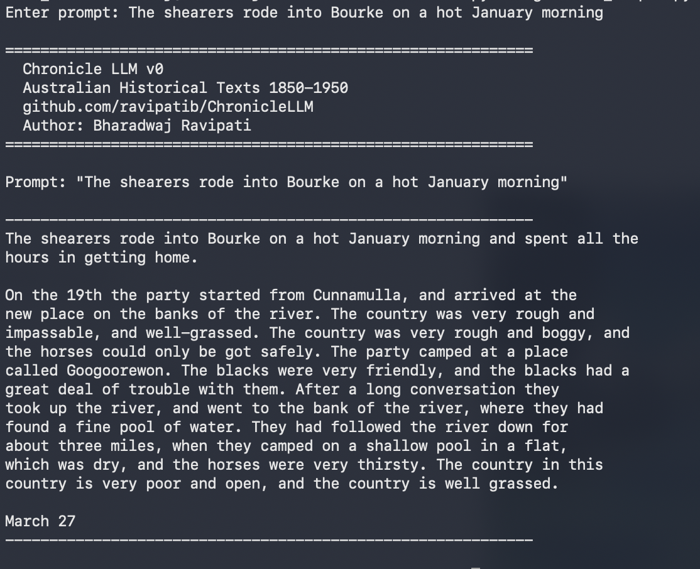
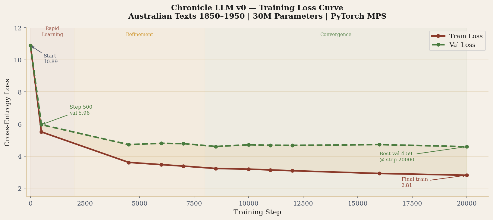
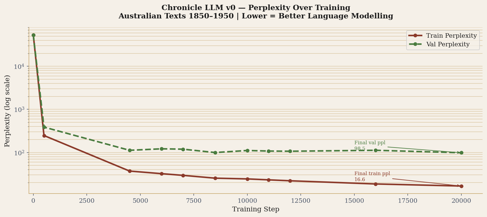
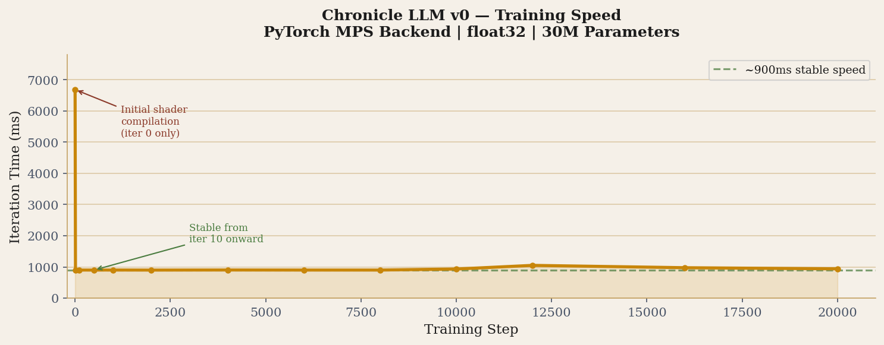
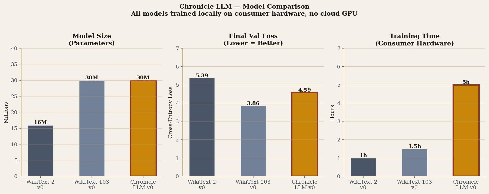

# Chronicle LLM 🇦🇺

A GPT-style language model trained from scratch on Australian texts from 1850–1950.
No fine-tuning. No modern weights. Built entirely from historical Australian writing.

[](https://opensource.org/licenses/MIT)
[](https://python.org)
[](https://pytorch.org)
[](https://github.com/karpathy/nanoGPT)
[]()
[]()

---

## Why I built this

I wanted to see if a small language model trained exclusively on a specific
historical period would genuinely reflect that era, not just stylistically,
but in terms of what it knows and doesn't know.

The idea is straightforward: if you only ever show a model text from
1850–1950 Australia, it has no concept of anything outside that window.
It can't reference the internet or modern politics because those things
don't exist in its training data. It doesn't perform the past. It just
is the past, in a sense.

The long-term goal is a model you can actually have a conversation with
that stays entirely within that historical context. Ask it about the
Eureka Stockade and it responds from within that world. Ask it about
smartphones and it has no idea what you're talking about.

v0 is a proof of concept. The outputs are rough in places but the
core idea works. The model has learned Australian colonial and
Federation-era language patterns from the ground up.

There's also a simpler reason. I've always been curious about what
daily life in that period actually felt like, not the headline events
but the texture of it. How people spoke to each other, what they read,
what mattered to them on an ordinary day in 1890. Building something
that absorbed that language from the inside felt like a more interesting
way to get at it than just reading about it.

---

## The training approach

The approach here is different from fine-tuning. If you take GPT-2 and
fine-tune it on historical data, the original pretraining doesn't
disappear. The model still carries modern knowledge underneath. It
can play the part but it isn't the part.

Training from scratch on a curated historical corpus means the model
only knows what it was shown. No hidden layers of modern English.
No contamination from post-1950 text. What you get is a model shaped
entirely by the language and knowledge of its training window.

I'm calling this Selective Temporal Training (STT): selecting a
specific time and place window and training exclusively within it.

---

## What the model knows

The training data covers:

- Gold rush era - Ballarat, Eureka Stockade, diggers, licence hunts
- Bush life - droving, shearing, selection, swagmen, the outback
- Convict era - transportation, penal colonies, emancipists
- Federation period - Australian identity, 1901 Constitution
- WWI - Gallipoli, Anzac, the Western Front, mateship
- Colonial cities - Melbourne, Sydney, class tension, immigration
- Exploration - Leichhardt, Sturt, Eyre, Burke and Wills
- Literature - Lawson, Paterson, Clarke, Baynton, Franklin

What it doesn't know: anything after 1950. No television, no
Cold War, no modern Australia. It simply hasn't seen any of that.

---

## Sample output

**Prompt:** *The shearers rode into Bourke on a hot January morning*

```
The shearers rode into Bourke on a hot January morning and spent all the
hours in getting home.

On the 19th the party started from Cunnamulla, and arrived at the
new place on the banks of the river. The country was very rough and
impassable, and well-grassed. The party camped at a place
called Googoorewon. The blacks were very friendly, and the blacks had a
great deal of trouble with them. After a long conversation they
took up the river, and went to the bank of the river, where they had
found a fine pool of water. They had followed the river down for
about three miles, when they camped on a shallow pool in a flat,
which was dry, and the horses were very thirsty. The country in this
country is very poor and open, and the country is well grassed.

March 27
```

Bourke, Cunnamulla, and Googoorewon are all real places. The model
picked these up from exploration journals in the training data, not
from any external knowledge source.

### Sample Output Screenshot


---

## Training

Trained entirely locally. No cloud GPU, no rented compute.

The full run took around 5 hours. Memory usage peaked at about 19GB.
PyTorch MPS backend (Apple Silicon) or CUDA both work fine for this
model size. Anyone with a reasonably modern machine can reproduce this.

```
Parameters      : 30M
Steps           : 20,000
Final train loss: 2.81
Final val loss  : 4.59
Training data   : 55MB / 141 texts / ~14M tokens
```

### Training Loss Curve


### Perplexity Over Training


### Training Speed


### Model Comparison


---

## Training data

All texts are public domain from [Project Gutenberg](https://gutenberg.org)
and [Project Gutenberg Australia](https://gutenberg.net.au). Every file
was checked to be Australian content from within the 1850–1950 window.

141 texts, 55MB cleaned, roughly 14M tokens.

Authors include Henry Lawson, Banjo Paterson, Marcus Clarke, Rolf Boldrewood,
Barbara Baynton, Steele Rudd, C.J. Dennis, Price Warung, Ada Cambridge,
Miles Franklin, Joseph Furphy, C.E.W. Bean, John Monash, Watkin Tench,
David Collins, K. Langloh Parker, Rafaello Carboni, and exploration
journals from Leichhardt, Sturt, Eyre, Giles, and Burke & Wills among others.

---

## Architecture

Built on [nanoGPT](https://github.com/karpathy/nanoGPT) by Andrej Karpathy.

```
Architecture    : GPT-2 decoder-only transformer
Parameters      : 30M
Layers          : 6
Attention heads : 6
Embedding dim   : 384
Context length  : 256 tokens
Tokenizer       : GPT-2 BPE (tiktoken)
Vocab size      : 50,304
```

Training config:

```python
n_layer    = 6
n_head     = 6
n_embd     = 384
block_size = 256
batch_size = 16
gradient_accumulation_steps = 4
max_iters      = 20000
learning_rate  = 1e-3
device         = 'mps'  # or 'cuda'
dtype          = 'float32'
```

---

## Running it

```bash
git clone https://github.com/ravipatib/ChronicleLLM
cd ChronicleLLM
pip install -r requirements.txt
```

This project requires nanoGPT as a dependency:

```bash
git clone https://github.com/karpathy/nanoGPT
```

Download and prepare data:

Download training texts manually from [Project Gutenberg Australia](https://gutenberg.net.au)
and [Project Gutenberg](https://gutenberg.org). Place `.txt` files in
`data/australia_1850_1950/raw/` then run:

```bash
python clean_texts.py
python data/australia_1850_1950/prepare.py
```

Train:

```bash
cd nanoGPT
ln -s ../data/australia_1850_1950 data/australia_1850_1950
# Windows users: copy the folder manually instead of using symlink
python train.py ../config/train_chronicle_v0.py
```

Generate:

Note: generation requires a trained checkpoint at `out-chronicle-v0/ckpt.pt`.
To use pretrained weights, train the model first using the steps
above. A HuggingFace upload is planned once v0 is finalised.

```bash
python generate_sample.py
# Enter prompt: The goldfields of Ballarat in 1854
```

Via API (LM Studio or any OpenAI-compatible server):

```bash
curl http://localhost:1234/v1/completions \
  -H "Content-Type: application/json" \
  -d '{
    "model": "chronicle-llm/v0",
    "prompt": "The bushrangers rode hard across",
    "max_tokens": 200,
    "temperature": 0.8
  }'
```

---

## Model versions

| Version | Params | Data | Tokens | Steps | Val Loss | Status |
|---------|--------|------|--------|-------|----------|--------|
| v0 | 30M | 55MB / 141 texts | 14M | 20,000 | 4.59 | Done |
| v1 | TBD | TBD | TBD | TBD | TBD | Planned |
| v2 | TBD | TBD | TBD | TBD | TBD | Roadmap |

---

## What's next

- v1 with more data, targeting 200MB with cleaner preprocessing
- Trove newspaper integration (National Library of Australia)
- Custom tokenizer trained on Australian English
- Temporal bias analysis
- Eventually a proper conversational interface

---

## Inspiration

- [nanoGPT](https://github.com/karpathy/nanoGPT) by Andrej Karpathy - architecture
- [TimeCapsuleLLM](https://github.com/haykgrigo3/TimeCapsuleLLM) by Hayk Grigorian - STT concept
- [TinyStories](https://arxiv.org/abs/2305.07759) - small models on curated data
- [Project Gutenberg Australia](https://gutenberg.net.au) - the data source
- [Trove](https://trove.nla.gov.au) - future data source

---

## Contributing

Issues and PRs welcome. Particularly interested in:
- More verified Australian 1850–1950 texts
- Better cleaning scripts
- Evaluation approaches for historical LMs

Please open an issue before submitting a PR.

---

## Citation

```bibtex
@misc{chroniclellm2025,
  author    = {Ravipati, Bharadwaj},
  title     = {Chronicle LLM: A Language Model Trained from Scratch
               on Australian Historical Texts 1850--1950},
  year      = {2025},
  publisher = {GitHub},
  url       = {https://github.com/ravipatib/ChronicleLLM}
}
```

---

## License

MIT - see [LICENSE](LICENSE).

Copyright (c) 2025 Bharadwaj Ravipati

Training data is public domain. Architecture based on
[nanoGPT](https://github.com/karpathy/nanoGPT) by Andrej Karpathy (MIT).

---
