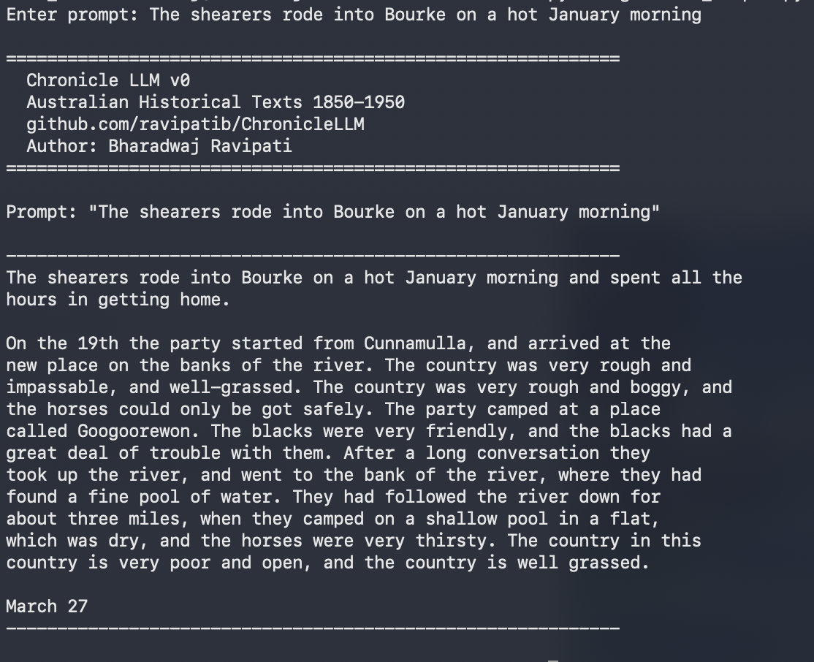
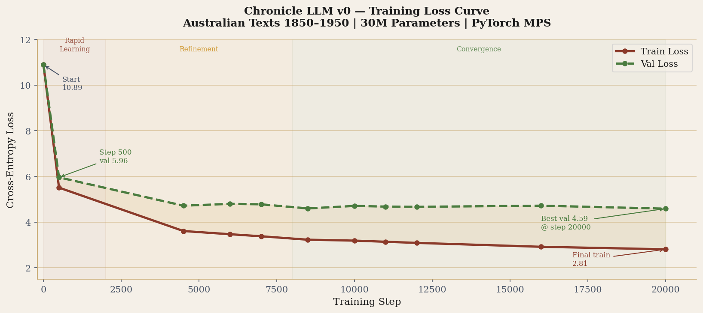
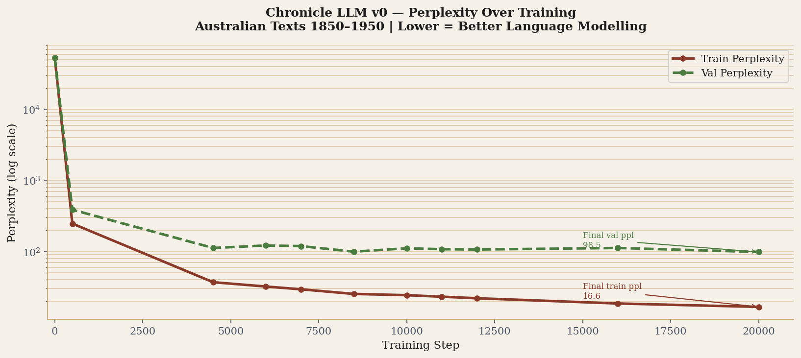
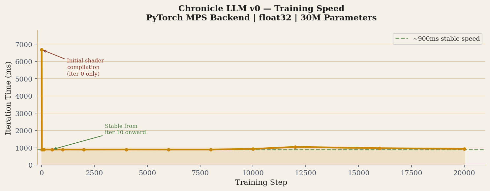
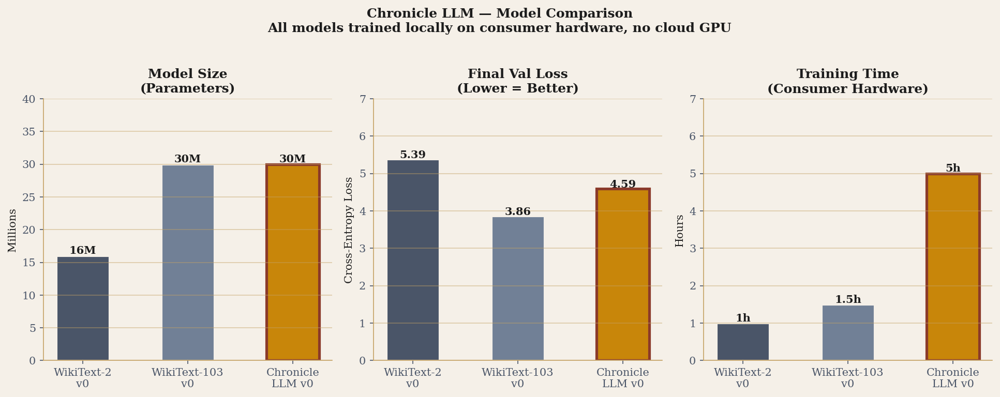

# Chronicle LLM 🇦🇺

A GPT-style language model trained from scratch on Australian texts from 1850–1950.
No fine-tuning. No modern weights. Built entirely from historical Australian writing.

[](https://opensource.org/licenses/MIT)
[](https://python.org)
[](https://pytorch.org)
[](https://github.com/karpathy/nanoGPT)
[]()
[]()
[](https://huggingface.co/Gnayo/chronicle-llm-v0)

---

## Why I built this

I got curious about whether training a model from scratch on a narrow
historical window would actually make it think differently, not just
sound different. The obvious way to test that was to try it.

Australia 1850-1950 felt like the right window. A hundred years of
gold rushes, bush life, convicts, federation, two world wars. Dense
with character and far enough back that nothing leaks through from
the modern world.

There's also a personal reason. I wanted to understand what daily life
in that era actually felt like, not the headline events but the texture
of it. How people spoke, what they read, what mattered on an ordinary
day in 1890. Building something that absorbed that language from the
inside seemed like a more interesting way to explore it.

v0 is small and the outputs are rough in places. But it works in the
sense that matters: the model has no idea what a smartphone is, and
it does know what a billy of tea is.

---

## The training approach

Most historical AI projects fine-tune an existing model. The problem
with that is the original training doesn't go away. You end up with
a model that sounds historical but still knows about modern things
underneath.

Training from scratch on exclusively historical data means the model
only knows what it was shown. No modern English underneath. No
contamination from post-1950 text.

I'm calling this Selective Temporal Training (STT): pick a time and
place window, train only on data from within it, start from zero.

---

## What the model knows

The training data covers:

- Gold rush era - Ballarat, Eureka Stockade, diggers, licence hunts
- Bush life - droving, shearing, selection, swagmen, the outback
- Convict era - transportation, penal colonies, emancipists
- Federation period - Australian identity, 1901 Constitution
- WWI - Gallipoli, Anzac, the Western Front, mateship
- Colonial cities - Melbourne, Sydney, class tension, immigration
- Exploration - Leichhardt, Sturt, Eyre, Burke and Wills
- Literature - Lawson, Paterson, Clarke, Baynton, Franklin

What it doesn't know: anything after 1950. No television, no
Cold War, no modern Australia. It simply hasn't seen any of that.

---

## Sample output

**Prompt:** *The shearers rode into Bourke on a hot January morning*

```
The shearers rode into Bourke on a hot January morning and spent all the
hours in getting home.

On the 19th the party started from Cunnamulla, and arrived at the
new place on the banks of the river. The country was very rough and
impassable, and well-grassed. The party camped at a place
called Googoorewon. The blacks were very friendly, and the blacks had a
great deal of trouble with them. After a long conversation they
took up the river, and went to the bank of the river, where they had
found a fine pool of water. They had followed the river down for
about three miles, when they camped on a shallow pool in a flat,
which was dry, and the horses were very thirsty. The country in this
country is very poor and open, and the country is well grassed.

March 27
```

Bourke, Cunnamulla, and Googoorewon are all real places. The model
picked these up from exploration journals in the training data, not
from any external knowledge source.

### Sample Output Screenshot


---

## Training

Trained entirely locally. No cloud GPU, no rented compute.

The full run took around 5 hours. Memory usage peaked at about 19GB.
PyTorch MPS backend (Apple Silicon) or CUDA both work fine for this
model size. Anyone with a reasonably modern machine can reproduce this.

```
Parameters      : 30M
Steps           : 20,000
Final train loss: 2.81
Final val loss  : 4.59
Training data   : 55MB / 141 texts / ~14M tokens
```

### Training Loss Curve


### Perplexity Over Training


### Training Speed


### Model Comparison


---

## Training data

All texts are public domain from [Project Gutenberg](https://gutenberg.org)
and [Project Gutenberg Australia](https://gutenberg.net.au). Every file
was checked to be Australian content from within the 1850–1950 window.

141 texts, 55MB cleaned, roughly 14M tokens.

Authors include Henry Lawson, Banjo Paterson, Marcus Clarke, Rolf Boldrewood,
Barbara Baynton, Steele Rudd, C.J. Dennis, Price Warung, Ada Cambridge,
Miles Franklin, Joseph Furphy, C.E.W. Bean, John Monash, Watkin Tench,
David Collins, K. Langloh Parker, Rafaello Carboni, and exploration
journals from Leichhardt, Sturt, Eyre, Giles, and Burke & Wills among others.

---

## Architecture

Built on [nanoGPT](https://github.com/karpathy/nanoGPT) by Andrej Karpathy.

```
Architecture    : GPT-2 decoder-only transformer
Parameters      : 30M
Layers          : 6
Attention heads : 6
Embedding dim   : 384
Context length  : 256 tokens
Tokenizer       : GPT-2 BPE (tiktoken)
Vocab size      : 50,304
```

Training config:

```python
n_layer    = 6
n_head     = 6
n_embd     = 384
block_size = 256
batch_size = 16
gradient_accumulation_steps = 4
max_iters      = 20000
learning_rate  = 1e-3
device         = 'mps'  # or 'cuda'
dtype          = 'float32'
```

---

## Model weights

Pretrained v0 weights are on HuggingFace:
[huggingface.co/Gnayo/chronicle-llm-v0](https://huggingface.co/Gnayo/chronicle-llm-v0)

Two formats available:
- `model.safetensors` - HuggingFace format, load via transformers
- `chronicle_v0.gguf` - GGUF format, load directly in LM Studio or llama.cpp

---

## Running it

```bash
git clone https://github.com/ravipatib/ChronicleLLM
cd ChronicleLLM
pip install -r requirements.txt
```

This project requires nanoGPT as a dependency:

```bash
git clone https://github.com/karpathy/nanoGPT
```

Download and prepare data:

Download training texts manually from [Project Gutenberg Australia](https://gutenberg.net.au)
and [Project Gutenberg](https://gutenberg.org). Place `.txt` files in
`data/australia_1850_1950/raw/` then run:

```bash
python clean_texts.py
python data/australia_1850_1950/prepare.py
```

Train:

```bash
cd nanoGPT
ln -s ../data/australia_1850_1950 data/australia_1850_1950
# Windows users: copy the folder manually instead of using symlink
python train.py ../config/train_chronicle_v0.py
```

Generate:

Pretrained weights are available on HuggingFace:
[huggingface.co/Gnayo/chronicle-llm-v0](https://huggingface.co/Gnayo/chronicle-llm-v0)

Download `chronicle_v0.gguf` from there to use directly in LM Studio,
or load the model weights via the transformers library.

To train your own version and generate from your checkpoint:

```bash
python generate_sample.py
# Enter prompt: The goldfields of Ballarat in 1854
```

Via API (LM Studio or any OpenAI-compatible server):

```bash
curl http://localhost:1234/v1/completions \
  -H "Content-Type: application/json" \
  -d '{
    "model": "chronicle-llm/v0",
    "prompt": "The bushrangers rode hard across",
    "max_tokens": 200,
    "temperature": 0.8
  }'
```

---

## Model versions

| Version | Params | Data | Tokens | Steps | Val Loss | Status |
|---------|--------|------|--------|-------|----------|--------|
| v0 | 30M | 55MB / 141 texts | 14M | 20,000 | 4.59 | Done |
| v1 | TBD | TBD | TBD | TBD | TBD | Planned |
| v2 | TBD | TBD | TBD | TBD | TBD | Roadmap |

---

## What's next

- v1 with more data, targeting 200MB with cleaner preprocessing
- Trove newspaper integration (National Library of Australia)
- Custom tokenizer trained on Australian English
- Temporal bias analysis
- Eventually a proper conversational interface

---

## Inspiration

- [nanoGPT](https://github.com/karpathy/nanoGPT) by Andrej Karpathy - architecture
- [TimeCapsuleLLM](https://github.com/haykgrigo3/TimeCapsuleLLM) by Hayk Grigorian - STT concept
- [TinyStories](https://arxiv.org/abs/2305.07759) - small models on curated data
- [Project Gutenberg Australia](https://gutenberg.net.au) - the data source
- [Trove](https://trove.nla.gov.au) - future data source

---

## Contributing

Issues and PRs welcome. Particularly interested in:
- More verified Australian 1850–1950 texts
- Better cleaning scripts
- Evaluation approaches for historical LMs

Please open an issue before submitting a PR.

---

## Citation

```bibtex
@misc{chroniclellm2025,
  author    = {Ravipati, Bharadwaj},
  title     = {Chronicle LLM: A Language Model Trained from Scratch
               on Australian Historical Texts 1850--1950},
  year      = {2026},
  publisher = {GitHub},
  url       = {https://github.com/ravipatib/ChronicleLLM}
}
```

---

## License

MIT. See [LICENSE](LICENSE) for details.

Copyright (c) 2026 Bharadwaj Ravipati

---
